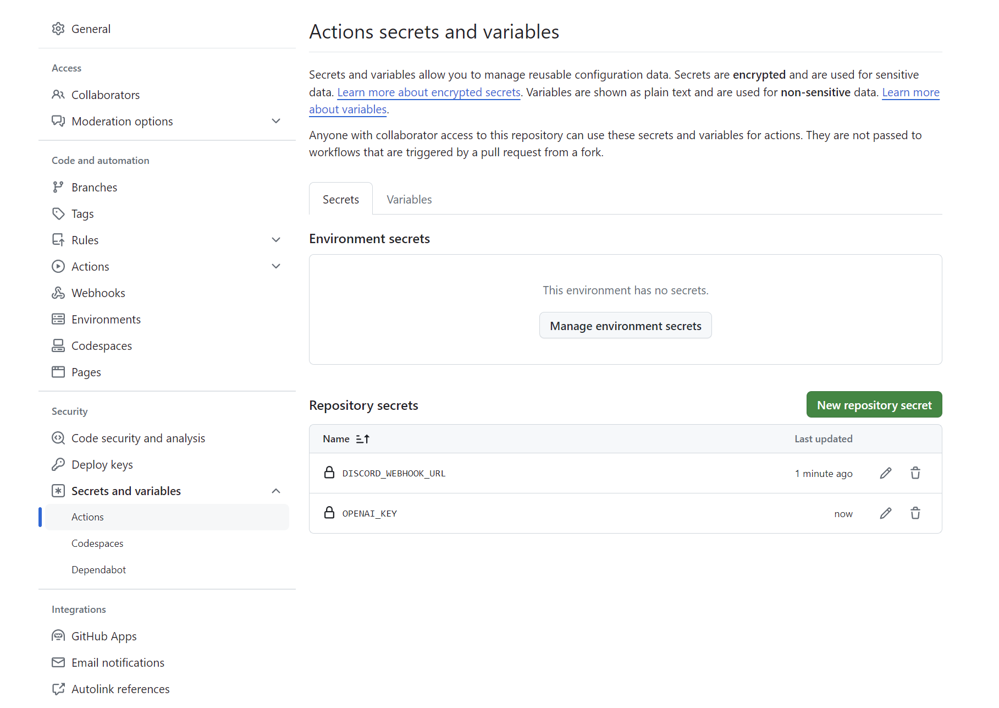
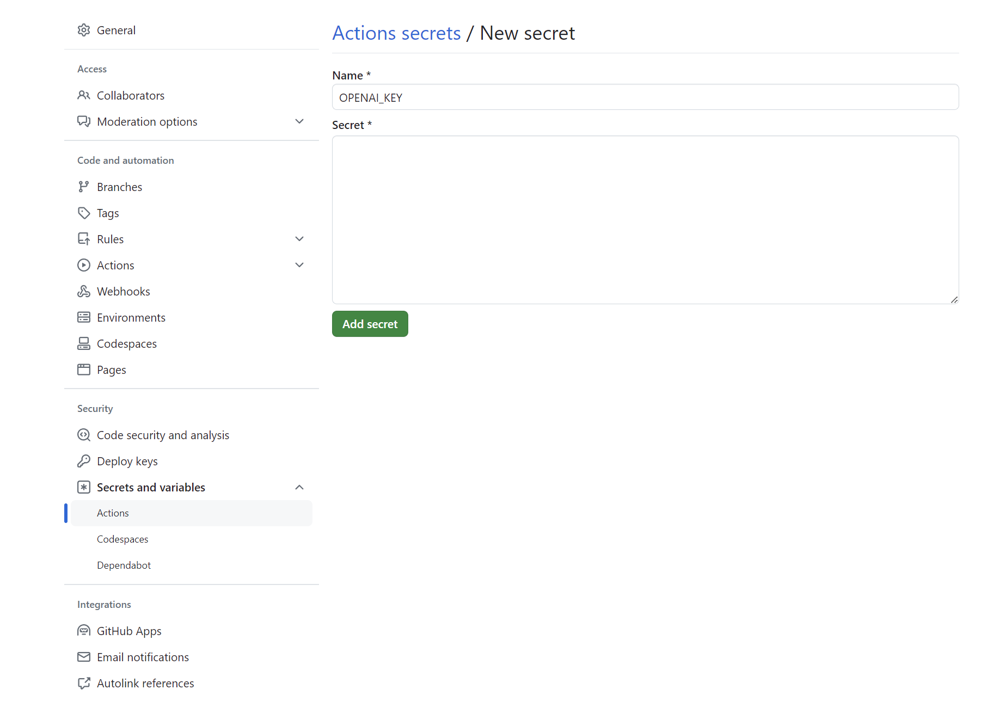
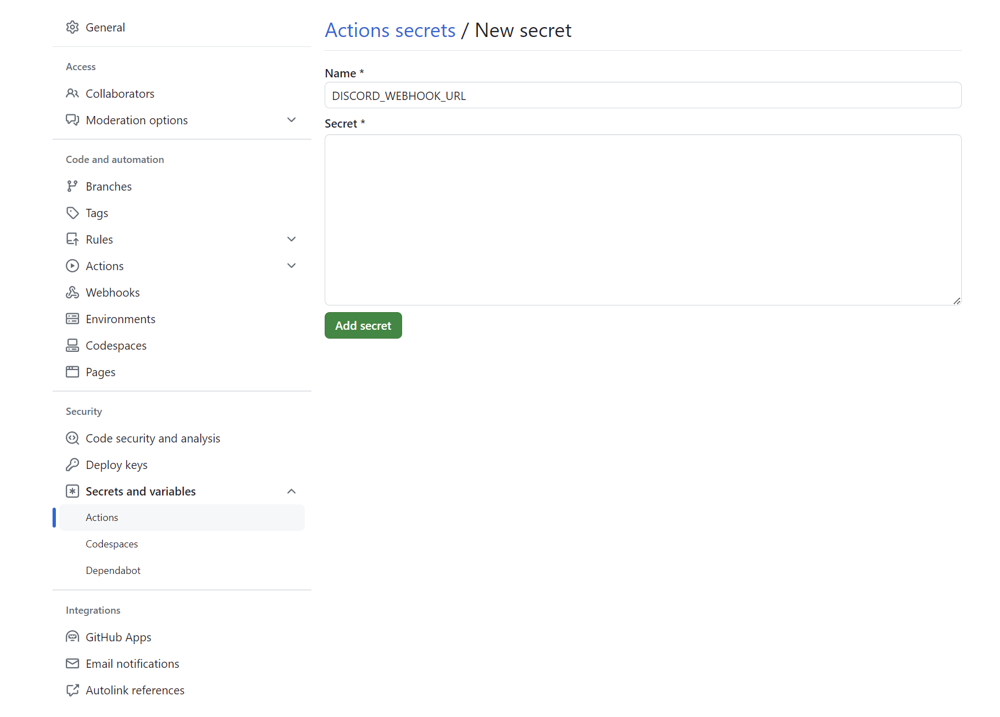

# Description

https://zenn.dev/ozushi/articles/ebe3f47bf50a86 と Carrier-Owl (https://github.com/fkubota/Carrier-Owl) を参考に、毎日 Dicord に新着 arXiv を通知する Bot を作りました。

## 特徴

- 複数のキーワードに興味の度合いを設定
- 論文のキーワードヒット数とキーワードの優先度がしきい値以上である論文を厳選
- タイトルの和訳・アブストの 3 行要約(日本語)を提供

# How to use

- python をインストール
- zip を解凍し適当なディレクトリに置く
- OpenAI の API キーと Discord の webhook URL を取得し、config.yaml に記載。
- 先程のディレクトリで

```bash
pip install -r requirements.txt
```

を実行

- config.yaml のキーワードを設定
- 以下を実行

```bash
python paper_arxiv.py
```

これで Discord に通知されます。
毎日通知させるにはもう少し作業が必要(PC に python スクリプトを定期実行させる設定 or 何かしらのクラウドサービスが必要)です。






